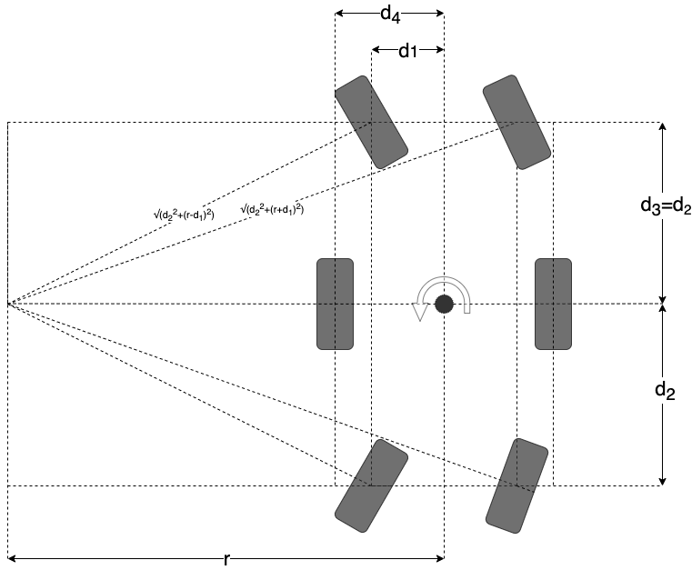

# ROS related code

## Catkin Packages

There are 4 catkin packages contained in this repo. Each of these packages performs a specific purpose in the ROS 
structure, which are covered below

  * `osr_control`: core code that talks to motor drivers and listens to commands 
  * `osr_interfaces`: custom message definitions
  * `osr_bringup`: configuration and launch files for starting the rover
  * ~~`led_screen`: code to communicate to the Arduino Uno to run the LED screen~~

Please refer to the docstrings wihin each file to gain understanding of the internals as that is the most
up-to-date and complete source of information.

### osr_control

  * `roboclaw.py`: copy of the roboclaw python library, API to the roboclaw controllers. ROS agnostic
  * `roboclaw_wrapper.py`: ROS node that wraps around and abstracts the roboclaw library. Takes in commands and reports 
  state of each motor
  * `servo_control.py`: ROS node that takes commands from the Rover node to send the corner servo motors to an angle and relays those to the PCA9685 chip
  * `rover.py`: ROS node that controls the rover, taking in high-level commands and calculating motor commands which are
  sent to `roboclaw_wrapper.py`

Note that a positive angular twist corresponds to a positive turning radius and turning left while driving forward.

### osr_interfaces
Contains custom message definitions used for the rover. Please refer to the message definitions for details
and units.

### osr_bringup 

The osr_bringup package contains the launch file necessary to start all the ROS nodes, 
as well as the operating parameters for the robot.

### led_screen

ROS nodes for interfacing with the screen.
