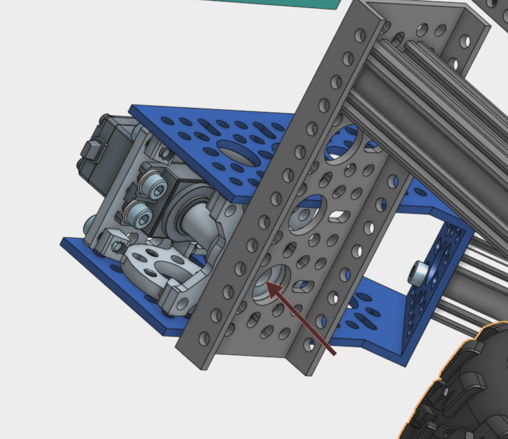
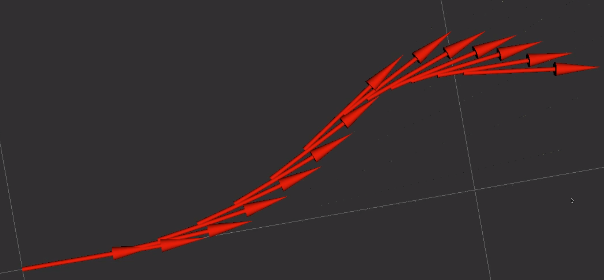

# Bringing up the rover code

**Important**: These instructions require you to have followed the steps in [rpi setup](rpi.md).

## Getting your rover ready for action

If this is the first time setting up the rover, you may want to take some precautions.

* put the rover's body on a box so that the wheels can spin without the rover hitting something by accident and the corner assemblies can rotate freely.
  * alternatively you can take off the wheels
* Attach the USB dongle for your remote controller (xbox or Spektrum or other)

## Configuring the rover parameters

If you have any differences compared to the default build, you can change many parameters spread out over three files. Rather than modifying the original files, any changes should be made to the `_mod.yaml` files you made earlier. This way your changes don't conflict with future updates.

The files follow the same structure as the default. Just include the values that you need to change as the default values for other parameters may change over time. Say for example you installed bigger wheels on the rover. The software needs to know this such that it can control what speed to command to each motor. Start by opening the file you just created:

```commandline
nano osr_params_mod.yaml
```

An editor (nano) should open, if not, you might have to install nano using 'sudo apt install nano'. You can also use an editor like VScode with an SSH extension so you can use a fully fledged editor while still working from a different computer.

If you wanted to update the value for the wheel radius, you would paste in the following snippet (compare with the contents of [osr_params.yaml](../ROS/osr_bringup/config/osr_params.yaml)).

```yaml
rover:
  ros__parameters:
    rover_dimensions:
      wheel_radius: 0.082  # [m]
```

The software will load in these changes and apply them. Take a look at the parameters for the [roboclaws](../ROS/osr_bringup/config/roboclaw_params.yaml) as well. If you used `nano`, you can save and exit the editor using `ctrl+o` followed by `ctrl+x`.

## Calibrating the corner servos

The servo motors at each corner have absolute encoders that will 'remember' where the wheels are even when power is turned off but we still have to calibrate them the first time so they know where the zero position is. Since the servo motors have a limited range of about 300 degrees, we'll want to make sure we are able to make use of the full range of motion. Start by unscrewing the M3 screw that connects the corner assembly to the servo output shaft using a 2.5mm hex wrench. Do this for all 4 corners. Detach the corner assembly from the servo so that the servo can spin freely.



First we'll send the servo motors to their zero positions. Since their range is from 0 to 300, we'll want the default position to be in the middle of that range at 150. Run the following commands:

```commandline
cd ~/osr_ws/src/osr-rover-code/scripts
python3 calibrate_servos.py 0 150
python3 calibrate_servos.py 1 150
python3 calibrate_servos.py 2 150
python3 calibrate_servos.py 3 150
```

With each line, you should see the back right (0), then front right (1), then front left (2), and finally back left (3) servo motor move to an angle of 150. If the servo isn't moving, it either means that it's already at that angle or that there's a problem with the wiring, PCB, or PCA9685 connection. Try setting the value to some other angle like 200 for that motor and see if it moves. If so, it's working. Move it back to 150. If not, check if the other servo motors move. 

When all servo motors where set to this angle, re-attach the corner assembly to the shaft using the M3 screw from before. When you do so, we recommend using a little bit of thread lock (e.g. loctite blue) so the screw doesn't unscrew and fall out while driving. In the following step we'll perform a finer calibration, so it's ok if the servo spline doesn't line up perfectly with the zero position of the corner assembly.

With each motor mounted, we can move ahead with aligning each corner assembly so that the wheels are pointing perfectly straight. We will do this by sending each corner assembly to different angles until it looks right. We'll use the same script for this. For one motor at a time, run the script with a slightly different value, for example we'll move the back right corner motor to 160 degrees:

```commandline
python3 calibrate_servos.py 0 160
```

If it's moving farther away from the center, try 140, if it's getting closer, try 165 or 170. Repeat this until the wheel is exactly at zero. When you find the value where it's centered, write it down since we'll need it later.

> [!IMPORTANT]
> Make sure the servo motors are still free to spin without much friction by lifting the servo bracket until the wheel doesn't touch the ground. You can either prop it up or hold it up manually.

Repeat this for wheels at channel 1, 2, and 3. You should have 4 values, for example `[135, 155, 125, 162]`. Now we need to tell the software what these values are, so when you command the corner motors to turn, they will use these values as the true centers. Open the file `osr_mod_launch.py`:

```commandline
nano ~/osr_ws/src/osr-rover-code/ROS/osr_bringup/launch/osr_mod_launch.py
```

Look for the line that says `parameters=[{'centered_pulse_widths': [165, 134, 135, 160]}]`. Replace the values using the 4 values you just found. Save and exit using ctrl+o then ctrl+x. The corner servo motors are calibrated and ready to go! Next we'll configure the gamepad to control the rover.

## Mapping remote controller buttons and axes to rover movement

Not all controllers are the same and so we'll want to configure which remote controller axis and button does what. We'll be configuring how fast the rover can go, which axis makes it move forwards and backwards, which axis makes it move left and right, and which axis makes it spin in place.

We'll be making these changes in the file `osr-rover-code/ROS/osr_bringup/launch/osr_mod_launch.py`. These values in the node joy_to_twist are of interest:

```yaml
    {"scale_linear": 0.05},  # scale to apply to drive speed, in m/s: drive_motor_rpm * 2pi / 60 * wheel radius * slowdown_factor
    {"scale_angular": 0.05},  # scale to apply to angular speed, in rad/s: scale_linear / min_radius
    {"scale_linear_turbo": 0.05},  # scale to apply to linear speed, in m/s
    {"enable_button": 0},  # which button to press to enable movement
    {"axis_linear.x": 3},
    {"axis_angular.yaw": 2},  # which joystick axis to use for rotating
    {"axis_angular.pitch": 0},  # axis to use for in-place rotation
```

Start by setting the `scale` variables (first three) low (e.g. 0.05) so you can easily confirm the rover moves as intended and avoid a potential crash. In the next steps once you have confirmed everything works ok, we'll set these scale values to more sensible settings.

Depending on which make and model of remote controller or gamepad/joystick you have, the buttons and axes (joysticks) may be represented differently. For that we'll launch the ROS 2 joy node and see what does what. Make sure your joystick is connected, then in a terminal run

```commandline
ros2 run joy joy_node
```

It should confirm that is is able to connect to your gamepad. Check this by opening a new separate terminal and listening for any messages coming from the joystick:

```commandline
ros2 topic echo /joy
```

You should see a constant flood of messages being printed. Move an axis or press a button on your controller and you should see a change in the output.

> [!TIP]
> If the joysticks aren't sending through data in a separate terminal, make sure they have the appropriate permissions; `sudo chmod a+rw /dev/input/event0`. The specific number may vary, run `ls -l /dev/input/*` to find out. If you don't see your controller when you run this command, head to [Troubleshooting your gamepad](#troubleshooting-your-gamepad).
> Then try again. You might want to consider using udev rules to automate this which you will need for automatic bringup using systemd services below.
If you need help, please post on the Slack forum.

Take a moment to choose which:

* button or switch on your controller you want to use to enable any movement to the rover. This switch/button is used so that the rover doesn't accidentally start driving when the controller falls or similar.
* axis you'd like to use to send the rover forwards/backwards
* axis you'd like to use to make the rover turn
* axis you'd like to use to make the rover rotate in place

You can always come back to this and change these later. In the window where the `ros2 topic echo /joy` messages are printing, for each of these axes and button you selected, write down which *index* in the list of axes/buttons changes when you move the axis. Open the file we looked at earlier `osr_mod_launch.py` and:

* when you move the axis that you'd like to use to control forward movement, take note of which number changes when you move the joystick. Counting starts at zero, so if the axis that changes is 3rd in the list, the axis number is 3-1=2. Enter this number (in this case 2) right after `axis_linear.x`.
* do the same for the axis you'd like to use for turning and for rotating in place, using `axis_angular.yaw` for turning and `axis_angular.pitch` for rotating in place.
* do the same for the button you'd like to use for enabling any movement in the first place. The button number (again count starting from 0) should go with `enable_button`.

## Confirming connection to the INA260

If you installed the INA260 voltage, current, and power monitor on the PCB, let's check if we're able to connec to it by running the test script:

```bash
cd ~/osr_ws/src/osr-rover-code/scripts
python3 test_ina260.py
```

This should show something similar to:

```
Attempting to connect INA260 at address 0x45...

Successfully read values. They should be nonzero:
Current: 0.198 A
Voltage: 15.006 V
Power: 2.87 W
```

If your INA260 is not at 0x45 but some other address (just make sure it doesn't conflict with the servo controller!), you can connect to it there through `python3 test_ina260.py 0x43` for address `0x43`.

## Manual rover bringup

Now you're all set up to launch the full rover software stack!

In a sourced terminal (`source /opt/ros/foxy/setup.bash && source ~/osr_ws/install/setup.bash`, unless you added these to your `~/.bashrc` file) already before, run

```commandline
ros2 launch osr_bringup osr_mod_launch.py
```

This will start up the ROS 2 nodes to run the rover with the changes you made in the previous steps.

Any errors or warnings will be displayed there in case something went wrong.  

### Note
It's pretty normal for the roboclaws to issue one or two Current Error messages on startup, which look like this:
  ```
  [roboclaw_wrapper-1] [ERROR] [timestamp] [roboclaw_wrapper]: Motor controller 128 reported error code 0x20003000 (hex: 0x20003000),
  [roboclaw_wrapper-1] M1 Current Error
  [roboclaw_wrapper-1] M2 Current Error
  ```
  As long as they are not continuous, they are not a problem.


- The ROS1::noetic version of gazebo simulation exists at https://github.com/dongjineee/rover_gazebo.


If you're using the Xbox wireless controller,
command the rover by holding the left back button (LB) down and moving the joysticks. You can boost as described in
the [RPi setup](rpi.md) by holding down the right back button (RB) instead. 
If you have questions, please post on the Slack forum in the `#troubleshooting` channel or if you think there's a problem with documentation, [submit an issue](https://github.com/nasa-jpl/osr-rover-code/issues/new).

> [!NOTE]
> If you notice the rover is moving in the opposite direction as your commands, add a minus sign to the appropriate `scale_` factor in the `osr_mod_launch.py` file. `ctrl-C` to stop the currently running code, then re-run it for the changes to take effect.

### Optional arguments

If you want the code to calculate and publish wheel odometry, launch with the argument `enable_odometry:=true`.

Odometry is used for localization and SLAM. 

## Revisiting linear and angular velocity scale

In the [earlier section](#Mapping remote controller buttons and axes to rover movement)

The maximum speed your rover can go is determined by the no-load speed of your drive motors. The default no-load speed is located
in the file [osr_params.yaml](../ROS/osr_bringup/config/osr_params.yaml) as `drive_no_load_rpm`, unless you modified it in the corresponding `_mod.yaml` file. 
This maximum speed corresponds to `scale_linear_turbo` and can be calculated as `drive_no_load_rpm * 2pi / 60 * wheel radius (=0.075m)`.
Based on this upper limit, later we'll set our regular moving speed to a sensible fraction of that which you can configure to your liking. This is because the motors will never reach the no load speed.
Start with e.g. 0.75 * scale_linear_turbo. If you think it's too slow or too fast, simply scale it up or down.

The turning speed of the rover, just like a regular car, depends on how fast it's going. As a result, `scale_angular`
should be set to `scale_linear / min_radius`. For the default configuration, the `min_radius` equals `0.45m`.

> [!CAUTION]
> At these speeds, the rover can be fast and strong enough to inflict damage or cause injury. Use caution and lower velocities to drive the rover in the presence of humans or obstacles.

## Automatic bringup with launch script

In this section we'll see how we can have the RPi automatically launch the rover code when it launches. That way you don't have to SSH in to run the rover and it can be controlled completely offline. Any modified parameters in `osr_mod_launch.py` and in the config folder will be found automatically.

> [!CAUTION]
> We do not recommend enabling the service until you have verified that everything
on your robot runs successfully manually. Once you enable the service, as soon as you power
on the RPi it will try and run everything. This could cause issues if everything has not yet
been fully tested and verified. Additionally, if you are doing development of your own software
for the robot we suggest disabling the service and doing manual launch of the scripts during
testing phases. This will help you more easily debug any issues with your code.

Starting scripts on boot using ROS can be a little more difficult than starting scripts on boot normally from the Raspberry Pi because of the default permission settings on the RPi and the fact that that ROS cannot be ran as the root user. The way that we will starting our rover code automatically on boot is to create a service that starts our roslaunch script, and then automatically run that service on boot of the robot.
[Further information](https://www.linode.com/docs/quick-answers/linux/start-service-at-boot/) on system service scripts running at boot.

There are two scripts in the [init_scripts](../init_scripts/) folder. The first is the bash file that runs the roslaunch file, and the other creates a system service to start that bash script. Open up a terminal on the Raspberry Pi and execute the following commands:

```bash
cd ~/osr_ws/src/osr-rover-code/init_scripts
# use symbolic links so we capture updates to these files in the service
sudo ln -s $(pwd)/launch_osr.sh /usr/local/bin/launch_osr.sh
sudo ln -s $(pwd)/osr_paths.sh /usr/local/bin/osr_paths.sh
sudo cp osr_startup.service /etc/systemd/system/osr_startup.service
sudo chmod 644 /etc/systemd/system/osr_startup.service
```

Modify the service file with `sudo nano /etc/systemd/system/osr_startup.service` and replace the User and Group with your username (when in doubt, on the Pi run `echo $USER` in a terminal) instead of 'Ubuntu'.

Your osr startup service is now installed on the Pi and ready to be used. The following are some commands
related to managing this service which you might find useful:

| Description                                  | Command                                    |
| -------------------------------------------- | ------------------------------------------ |
| Start service                                | sudo systemctl start osr_startup.service   |
| Stop service                                 | sudo systemctl stop osr_startup.service    |
| Enable service (runs on boot of RPi)         | sudo systemctl enable osr_startup.service  |
| Disable service (doesn’t run on boot of RPi) | sudo systemctl disable osr_startup.service |
| Check status of service                      | sudo systemctl status osr_startup.service  |
| View live service list                       | sudo journalctl -f                         |

Once you have fully tested the robot and made sure that everything is running correctly by starting the rover code manually
via `ros2 launch osr_bringup osr_mod_launch.py`, enable the startup service on the robot with the command below:

```commandline
sudo systemctl enable osr_startup.service
```

At this point, your rover should be fully functional and automatically run whenever you boot it up! Congratulations and happy roving!!

> [!IMPORTANT]
> When you're working on the code, recalibrating the servo motors, or otherwise launching the code manually, don't forget to turn off (`stop`) the code running in the background via the systemd service!

## Trigger custom actions using your gamepad

In `osr_launch.py`, you'll find a commented out node with executable [joy_extras.py](../ROS/osr_control/osr_control/joy_extras.py). This node serves as an example of how to trigger certain actions based on button clicks or axis movements on your gamepad. In the example, when a button is pressed, configured through parameter `duty_button_index`, the code will change the parameter `duty_mode` on the `roboclaw_wrapper` node. This effectively toggles between duty and velocity drive mode.

You can modify this file or create a similar one and instead use the button's axes to perform any other action you'd like. When changing parameters, make sure that like the `duty_mode` parameter, the node you're changing the parameter for supports dynamically reconfiguring paramters through the `add_on_set_parameters_callback` function.

## Troubleshooting your gamepad

If your gamepad doesn't show up when you run `ls -l /dev/input/*`, it may not work with the linux kernel. This is common with 'knockoffs', unofficial third-party sold cheaper models. The easiest way to verify this is to borrow someone else's genuine controller, but you can also take a look at the kernel messages to see if your controller is picked up by the kernel.

> [!NOTE]
> If you're using a bluetooth controller and a RPi3 or RPi4, you likely will have issues. This is because bluetooth only works well if it can use the same interface as the UART serial port is using, which we need to talk to the roboclaws. See [#187](https://github.com/nasa-jpl/osr-rover-code/pull/187) for more.

1. unplug the usb dongle or wired gamepad
2. on your raspberry pi (through SSH), check if dmesg detects any usb events by running `sudo dmesg | grep usb`. Input your password and you should see some output.
3. plug in the usb and rerun the command. You should see some new lines compared to the previous output. In my case, I see the following:
   ```
   [    4.643030] input: Horizon Hobby SPEKTRUM RECEIVER as /devices/platform/scb/fd500000.pcie/pci0000:00/0000:00:00.0/0000:01:00.0/usb1/1-1/1-1.1/1-1.1.4/1-   
   1.1.4:1.0/0003:0483:572B.0001/input/input0
   [    4.643570] hid-generic 0003:0483:572B.0001: input,hidraw0: USB HID v1.11 Gamepad [Horizon Hobby SPEKTRUM RECEIVER] on usb-0000:01:00.0-1.1.4/input0
   ```
   proving that my Spektrum USB controller was detected. If you don't see any messages, that xbox adapter probably just doesn't work with linux or you got unlucky and received a faulty one.


